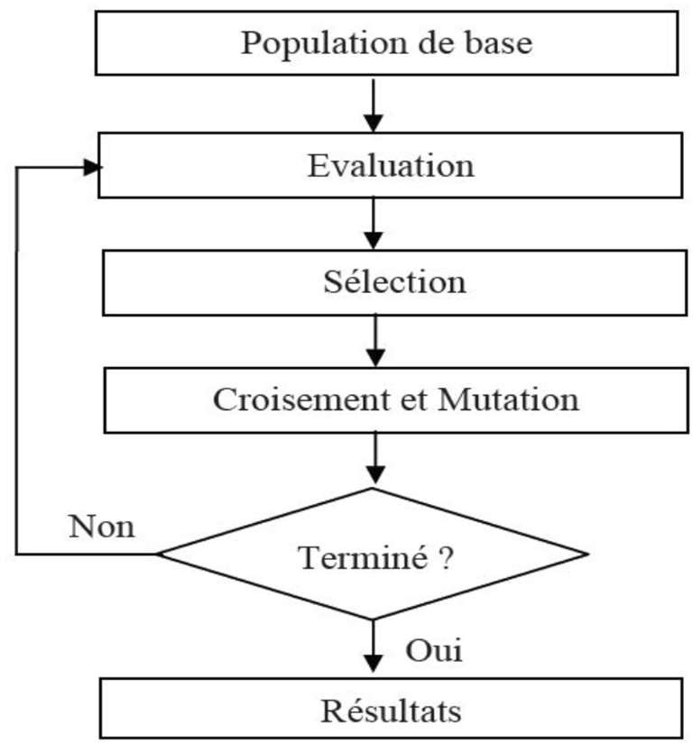

#  Algorithme génétique
### IUT Montpellier-Sète – Département Informatique

| `WARNING: Work in progress` |
| --- |

# Présentation
Projet créé et initié dans le cadre d'un projet tuteuré en formation de *DUT Année Spéciale en informatique* à l'*Institut Universitaire Technologie de Montpellier-Sète* pour la promotion 2019-2020 en collaboration par :
 - [TERIIHOANIA Joan](http://joan-teriihoania.fr/),
 - ODOR Thibault,
 - FAVOT Lino,
 - BES Jean-Baptiste.

Sous la supervision de **[BOUGERET Marin](http://www.lirmm.fr/~bougeret/)**, enseignant-chercheur au *LIRMM de Montpellier*.

# Fonctionnement
## Définition
L'algorithme génétique se base sur une évolution par sélection naturelle. Le principe de sélection naturelle est basé sur la théorie de *[Darwin](https://fr.wikipedia.org/wiki/Charles_Darwin)*. Ce principe repose sur la base d'une valeur sélective définie à chaque individu parmi une massée variée et difforme pour obtenir, sur une période donnée, une souche détenant les paramètres les mieux adaptés à un environnement et des critères d'évaluation déterminés. L'individu faisant parti d'une population d'une génération à un instant `t` et pouvant passer ses "gènes" à un individu fils de la génération à l'instant `t+1` en passant par une phase d'évaluation, sélection, croisement, mutation puis réinsertion.

> **Note :** Il est possible de coupler cet algorithme à un réseau de neurones informatique ou *Neural Network* basé sur les idées du psychologue *Franck Rosenblatt*.