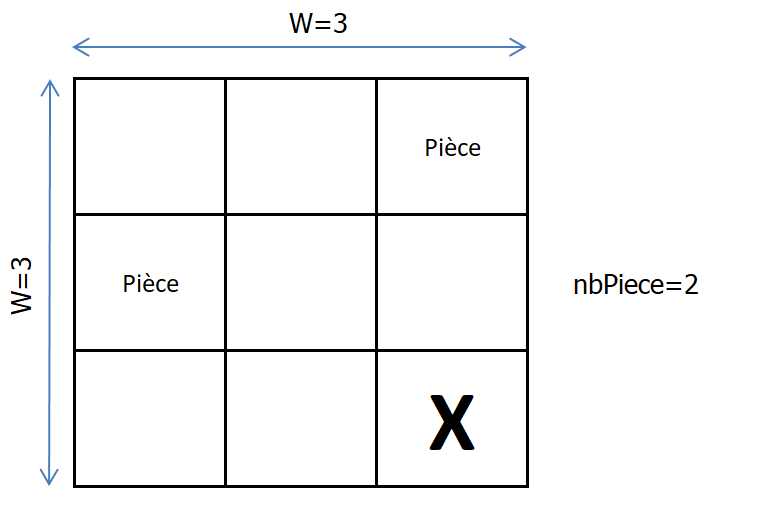

# Le projet
Projet créé et initié dans le cadre d'un projet tuteuré par des étudiants en formation de *DUT Année Spéciale en informatique* à l'*Institut Universitaire Technologique de Montpellier-Sète* pour la promotion 2019-2020 :
 - [TERIIHOANIA Joan](http://joan-teriihoania.fr/),
 - ODOR Thibault,
 - FAVOT Lino,
 - BES Jean-Baptiste.

Sous la supervision de **[BOUGERET Marin](http://www.lirmm.fr/~bougeret/)**, enseignant-chercheur au *LIRMM de Montpellier*.

## Notation et légende
Au travers de ce document, des termes et expressions cliquables sont disponibles redirigeant vers de la documentation en ligne afin d'apporter un support documentaire éventuel aux idées décrites. Ces éléments cliquables sont indiqués par la présence d'une icône les précédant. Par exemple : [Wikipedia](https://fr.wikipedia.org/wiki/Wikip%C3%A9dia:Accueil_principal).

# Préambule

## Définition
L'algorithme génétique se base sur une évolution par sélection naturelle. Le principe de *[sélection naturelle](https://fr.wikipedia.org/wiki/S%C3%A9lection_naturelle)* est basé sur la théorie de *[Darwin](https://fr.wikipedia.org/wiki/Charles_Darwin)*. Ce principe repose sur la base d'une valeur sélective définie à chaque individu parmi une masse plus ou moins difforme pour obtenir, sur une période donnée, une souche détenant les paramètres les mieux adaptés à un environnement sélectionné sur des critères d'évaluation déterminés. L'individu `a` faisant parti d'une population d'une génération à un instant `t` et pouvant passer ses "gènes" `G` à un individu `b` fils de la génération à l'instant `t+1` en passant par une phase d'évaluation, sélection, croisement, mutation puis réinsertion.

> **Important :** Afin de préserver un potentiel d'évolutivité, l'algorithme ne doit ni être eugéniste (*[Eugénisme](https://fr.wikipedia.org/wiki/Eug%C3%A9nisme)*) ni élitiste. Les individus de la population, qu'ils soient faiblement ou moyennement évalués ne doivent pas être supprimés pour conserver une certaine diversité au sein de la population et éviter une stagnation.

> Par la même occasion, la sélection des individus à croiser et muter ne doit pas totalement ignorer les individus faiblement ou moyennement évalués.

Nous pouvons représenter ce schéma de réalisation par le suivant :

### Sélection
L'algorithme sélectionne un certain nombre d'individu (ou part de la population définie) arbitrairement. Les individus sélectionnés subiront les phases suivantes de croisement et mutation. La façon dont les individus sont sélectionnés peut varier :

1. **Aléatoire simple** : On sélectionne les individus de manière totalement aléatoire. Elle peut permet d'obtenir une sélection difforme et variée et d'ainsi varier les individus qui suivront.
2. **Aléatoire pondéré** : On attribue à chaque individu une `valeur sélective` puis, en se basant sur celle-ci, sélectionne les individus de manière aléatoire. Aussi, un individu dont la valeur est plus élevée aura plus de chance d'être sélectionné. *Il est important de garder en tête que l'algorithme ne doit pas être "sur-sélectif". Il n'est donc pas pertinent de rendre la valeur des individus les moins évalués nulle afin de leur donner une chance d'être sélectionné, évoluer et éventuellement s'améliorer.* Elle permet d'obtenir une sélection difforme et variée tout en privilégiant les gènes les plus efficients sans ignorer les moins efficients.
3. **Prédéterminée** : On attribue un nombre (ou pourcentage) déterminé lors du lancement de l'algorithme qui sélectionnera (en fonction de ce nombre ou pourcentage) les individus parmi une part préalablement déterminée de la population (en fonction de leur évaluation). *Entre autre, il sera opportun d'effectuer notre sélection en grand majorité parmi la population la mieux évalués, et parmi la population dont l'évaluation est moyenne et faible.*

> **Note :** La méthode prédéterministe peut être mixée avec les méthodes aléatoires.
La méthode de sélection peut différer en fonction du résultat escompté. On privilégiera dans ce projet la méthode de **sélection aléatoire pondérée**.

### Croisement
Parmi la population sélectionnée par la phase précédente, l'algorithme effectue un croisement de gène. Celui-ci peut se faire entre deux individus ou plus (principalement 2). Cette phase permet de produire une population (dont les individus sont principalement bien évaluée) dont les gènes sont croisés et diversifié par rapport à la population de départ. *La persistence des individus dont les performances sont faibles ou moyennes leur permet de s'améliorer grâce aux individus les mieux évalués.*

> **Note :** Usuellement, la population d'entrée `a` est supprimée et remplacée par la population de sortie `b`. Il faut donc que cette phase produise pour des croisements entre `n` individus, `n` individus croisés afin de garder une population au même nombre que celle d'entrée.

> **Vocabulaire :**
>  - *Elément d'un gène :* Prenant un gène de type chaîne de caractères, un caractère est un élément du gène.
>  - *Partie d'un gène :* Une partie d'un gène est une section découpée du gène de `x` élément.

Les méthodes de croisement d'individus existent sous plusieurs formes :

1. **Aléatoire simple** : Chaque élément (ou partie) du gène des `n` individus sont parcourus afin de produire un individu. L'algorithme choisi aléatoirement l'élément (ou partie) de l'individu `A`, `B`, etc. Cela produit alors un nouveau gène mêlant les éléments (ou parties) de l'individu `A`, `B`, etc. Cette opération est effectuée `n` fois afin de produire une population de quantité équivalente.
2. **Aléatoire hiérarchisé (ou pondéré)** : On considère que chaque type de gène dispose d'une coefficient (ou `valeur sélective` à la manière d'un individu). Ce dernier est utilisé comme base afin de pondérer le choix entre les gènes des individus croisés. Un gène à coefficient élevé a des chances plus élevées d'être sélectionné. Il en existe deux formes :
    - **Statique** : Ici, les gènes disposent d'une hiérarchie (dont les valeurs sont fixées arbitrairement au départ de la simulation). Chaque élément du gène des individus possèdent un coefficient qui identifie son niveau par rapport à un autre. Par exemple, la hiérarchie `G>B>N` (dont les coefficients sont `3>2>1`) où `B=2` est supérieur à `N=1` mais inférieur à `G=3`. De la même manière qu'une méthode de sélection aléatoire pondérée, l'algorithme choisi un élément aléatoirement entre l'individu `A` et `B` où l'élément dont la valeur hiérarchique est supérieure a plus de chance d'être sélectionnée.
    - **Dynamique** : Cette méthode reprend le fonctionnement de la méthode de croisement aléatoire pondéré statique mais dans laquelle la hiérarchie des gènes n'est pas statique mais dynamique. C'est-à-dire qu'elle évolue à chaque génération et chaque population en fonction des gènes de cette dernière. Ainsi, une population dans laquelle le gène `G` est dominant verra sa hiérarchie telle que `G>...` Bien entendu, il est possible d'effectuer un *décalage* entre une génération `n` et une génération `n+k` tel que : `h(n)` de `p(n)` est utilisée sur `p(n+1)` où `h` (hiérarchie), `p` (population), `n` (numéro de génération) et `k` (nombre de génération de décalage). Le dynamisme d'une hiérarchie peut se décliner sous deux formes :
        - **Dynamisme général** : Une population possède une hiérarchie commune. Celle-ci est recalculée au début de la phase de croisement en fonction de la quantité du gène au sein de la population totale ou sélectionnée.
        - **Dynamisme unitaire** : Pour une population avec un gène de `k` élément, il existe `k` hiérarchie commune recalculée au début de la phase de croisement pour chaque `k`ème élément `e` du gène `G` (noté `e[k]`) qui dispose d'une hiérarchie de l'élément `k` notée `h(e[k])` dont le dynamisme évolue en fonction de la quantité des gènes de la popoulation du `k`ème élémént. *Soit la hiérarchie `h(e[1])`, la hiérarchie de l'élément `1`.*

### Mutation
La population résultant de la phase de croisement est alors soumise à la phase de mutation. Durant cette dernière, chaque élément (ou partie) de leur gène a la possibilité de muter (*Les chances de mutation sont par usage très faibles dans les alentours de 0.05%*) en un autre gène déterminé aléatoirement. Cette phase a pour but de donner une chance d'évolution et de diversification à la population.

## Objectif

L'objectif du principe de sélection naturelle est donc de déterminer l'individu le plus efficient et efficace et obtenir une solution rapide à une situation.

L'objectif de ce projet est :
 - D'une première part, **produire** un algorithme et une structure algorithmique permettant de calculer et **simuler** l'évolution d'une population d'individus dans un environnement pré-déterminé;
 - D'une seconde part, **observer** leur comportement afin d'en extrapoler des résultats que nous tenterons d'expliquer et d'évaluer.

 Dans un environnement déterminé surnommé `problème`, des individus surnommés `solutions` sont confrontés afin de déterminer lequel, selon des critères donnés, a le plus de valeur et sera sélectionné pour l'environnement confronté à le surmonter.

**En d'autres mots,** pour un problème établi, nous émettons des "*hypothèses*" de solutions qui, au fur et à mesure de la simulation, établieront selon leur évaluation leur efficacité à résoudre le problème édicté. *On peut considérer que la solution de chaque individu est un gène `G` qui leur est inné et qu'ils peuvent transmettre, croiser et muter*.

Cette situation, bien que relativement simple, peut avoir des applications variées. Qu'il s'agisse d'une simulation naturelle ou d'un environnement économique où les individus sont des entreprises.

Il est important de garder en tête que l'algorithme et toutes les phases qui le composent, notamment les phases de sélection, mutation et croisement, doivent être optimisés. Etant donné qu'un algorithme génétique se base sur une population avec un nombre élevé pour avoir un résultat adéquat.

## Supports

Il est possible de coupler cet algorithme à un réseau de neurones artificiels ou [*Neural Network*](https://fr.wikipedia.org/wiki/R%C3%A9seau_de_neurones_artificiels) basé sur les idées du psychologue [*Franck Rosenblatt*](https://fr.wikipedia.org/wiki/Frank_Rosenblatt). Notamment pour le calcul des poids de neurones. *Quelques lectures peuvent être trouvées à ce sujet dont (en anglais) :*
 - [*"Deep Learning with Darwin: Evolutionary Synthesis of Deep Neural Networks"*](https://arxiv.org/pdf/1606.04393.pdf) de M. J. Shafiee, A. Mishra et A. Wong;
 - [*"Evolutionary Robot Behaviors Based on Natural Selection and Neural Network"*](https://link.springer.com/chapter/10.1007/1-4020-8151-0_6) dans *Artificial Intelligence Applications and Innovations* de M. Bramer et V. Devedzic;
 - [*"Evolving Neural Networks"*](https://home.fnal.gov/~souvik/Brain/index.html) et [*"A biology-inspired neural network evolving through natural
selection"*](https://home.fnal.gov/~souvik/Brain/BrainInWorld.pdf) de Souvik Das ;
 - Ou encore, un jeu de simulation [*"The Bibites"*](https://leocaussan.itch.io/the-bibites) développé par Léo Caussan dont le développement peut être suivi depuis sa chaîne [YouTube](https://www.youtube.com/channel/UCjJEUMnBFHOP2zpBc7vCnsA).

# Déroulement

## Cas concret
Afin d'obtenir les résultats escomptés par l'objectif de ce projet, il est opportun de réaliser un exercice. Avant de produire un algorithme génétique généralisant les cas d'utilisation d'une évolution, nous pouvons nous consacrer à la réalisation d'un cas concret et spécifique afin de l'utiliser comme base du cas général. Comme cas concret, nous prendrons le suivant :

**Environnement** : Nous disposons d'un plateau de `W x W` cases. Chaque case peut contenir `Pièce` ou pas (*Ces pièces sont au nombre `nbPiece` réparties aléatoirement sur le plateau*). D'une position initiale `X` du pion `Pion` et d'un entier `n`.

**Problème** : *Quel est l'enchaînement de mouvement/pas `M` à partir de la position `X` qui permet de récupérer le plus de `Pièce` avec `n` pas ?*

**Mouvement** : Un mouvement `M` peut être **H**aut, **B**as, **G**auche, **D**roite relatif à la position actuelle de `Pion` et à l'axe du plateau. Un mouvement `M` est valide tant qu'il ne fait pas sortir le pion en dehors des limites du plateau.

**Individu** : Chaque *individu* de la population contiendra une solution/gène `G` : une suite de `n` caractère(s) chacun représentant un mouvement/pas de type `M`.

**Evaluation** : Chacun *individu* sera évalué et obtiendra un capital d'évaluation ou `valeur sélective` qui sera calculée en fonction du nombre de `Pièce` qu'il aura effectué, de la distance parcourue entre chacune et, éventuellement, du nombre de mouvement invalide. *Il sera opportun d'évaluer chaque individu par rapport à la performance d'autrui en gardant en tête que l'évaluation de l'un ne devrait pas être équivalente à un autre même s'ils ont collectés le même nombre de pièces.*

### Gestion du code

Qu'il s'agisse de la phase de versionning ou de travail collaboratif, plusieurs plateformes seront utilisées afin de permettre un partage efficace du code. En outre, nous avons utilisé, utilisons ou avons tenté d'utiliser des applications telles que :
 - **Github** (principalement);
 - **Floobits** (plateforme de codage collaboratif en temps réel);

Néanmoins, après avoir essayé la plateforme *Floobits*, nous avons observé que cette méthode de travail et de fonctionnement n'était pas opportun pour notre travail d'équipe, n'étant pas adapté à notre méthode de fonctionnement. Nous avons utilisé également un package implémenté dans Java dans notre code ou afin de tester l'application : *Junit* pour produire des tests unitaires et vérifier le fonctionnement de nos méthodes et fonctions.

Au départ du projet, nous avons débuté le code en créant des dossiers séparés au sein du dépôt afin de pouvoir créer une version de notre projet chacun de notre côté. Après quelques semaines, nous avons rapidement conclus qu'il s'agissait d'une mauvaise idée, car menant à de trop grandes différences et un travail de synchronisation supplémentaire et qui aurait pu être évité. Après cette conclusion, nous avons donc refactorisé le code dans une version unique et commune sur laquelle chaque membre aura des tâches à faire spécifiques, en profitant de cette refactorisation pour mettre en commun nos idées.

### Architecture du code

L'architecture du code se base sur la logique orientée objet du langage Java qui sera utilisé pour le développement de l'algorithme génétique. Afin de rendre la structure du code générale à toute sorte d'application de l'algorithme, il sera opportun d'utiliser des classes **abstraites** ou des **interfaces** (vues en cours de *Programmation orientée objet*) et l'intégration des fonctions essentielles à l'exécution de l'algorithme.

### Classes
Visiblement, nous aurons besoin d'au moins deux classes pour l'environnement (`Plateau`) et l'individu (`Pion`). A partir de cette situation, il nous est possible d'identifier plusieurs classes permettant la réalisation de cet algorithme :
 - `Plateau` ;
 - Et `Individu`.

Les relations des classes peuvent être exprimées avec le schéma suivant :

Au début du projet, il avait été jugé potentiellement opportun de créer une classe intermédiaire qui se chargerait du contrôle de chaque étape de vérification : `Mouvement`. Mais après réflexion, la création de cette classe rendait la classe Individu inutile, étant donné que presque toutes, si ce n'est toutes, les méthodes appelaient les méthodes de la classe `Mouvement`, rendant la classe `Individu` inutile. Il est donc préférable de se tenir aux deux classes ci-dessus pour le moment.